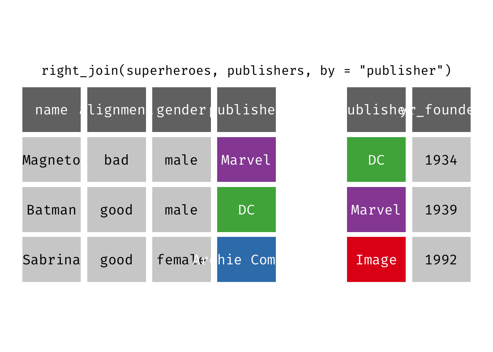
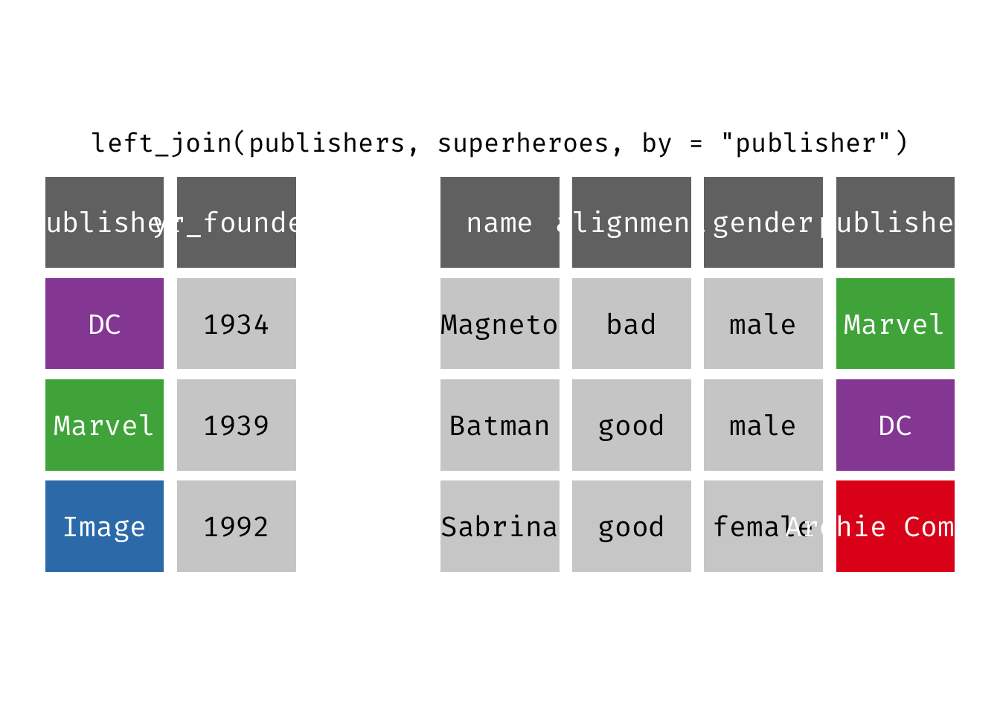

**Relational data** is multiple tables of data that when combined together answer research questions. Relations define the important element, not just the individual tables. Relations are defined between a pair of tables, or potentially complex structures can be built up with more than 2 tables. In many situations, data is stored in a relational format because to do otherwise would introduce redundancy and use unnecessary storage space.

This data structure requires **relational verbs** to combine data across tables. **Mutating joins** add new variables to one data frame from matching observations in another, whereas **filtering joins** filter observations from one data frame based on whether or not they match an observation in the other table.

## `superheroes` and `publishers`

Let's review how these different types of joining operations work with relational data on comic books. Load the `rcis` library. There are two data frames which contain data on comic books.


```r
library(tidyverse)
library(rcis)

superheroes
```

```
## # A tibble: 3 × 4
##   name    alignment gender publisher    
##   <chr>   <chr>     <chr>  <chr>        
## 1 Magneto bad       male   Marvel       
## 2 Batman  good      male   DC           
## 3 Sabrina good      female Archie Comics
```

```r
publishers
```

```
## # A tibble: 3 × 2
##   publisher yr_founded
##   <chr>          <dbl>
## 1 DC              1934
## 2 Marvel          1939
## 3 Image           1992
```

Would it make sense to store these two data frames in the same tibble? **No!** This is because each data frame contains substantively different information:

* `superheroes` contains data on superheroes
* `publishers` contains data on publishers

The units of analysis are completely different. Just as it made sense to split [Minard's data into two separate data frames](/notes/minard/), it also makes sense to store them separately here. That said, depending on the type of analysis you seek to perform, it makes sense to join the data frames together temporarily. How should we join them? Well it depends on how you plan to ask your question. Let's look at the result of several different join operations.


## Mutating joins

## Inner join

{}

`inner_join(x, y)`: Return all rows from `x` where there are matching values in `y`, and all columns from `x` and `y`. If there are multiple matches between `x` and `y`, all combination of the matches are returned. This is a mutating join.

{}


<!-- -->


```r
(ijsp <- inner_join(x = superheroes, y = publishers))
```

```
## Joining, by = "publisher"
```

```
## # A tibble: 2 × 5
##   name    alignment gender publisher yr_founded
##   <chr>   <chr>     <chr>  <chr>          <dbl>
## 1 Magneto bad       male   Marvel          1939
## 2 Batman  good      male   DC              1934
```

We lose Sabrina in the join because, although she appears in `x = superheroes`, her publisher Archie Comics does not appear in `y = publishers`. The join result has all variables from `x = superheroes` plus `yr_founded`, from `y`.
  
## Left join

{}

`left_join(x, y)`: Return all rows from `x`, and all columns from `x` and `y`. If there are multiple matches between `x` and `y`, all combination of the matches are returned. This is a mutating join.

{}

<!-- -->


```r
(ljsp <- left_join(x = superheroes, y = publishers))
```

```
## Joining, by = "publisher"
```

```
## # A tibble: 3 × 5
##   name    alignment gender publisher     yr_founded
##   <chr>   <chr>     <chr>  <chr>              <dbl>
## 1 Magneto bad       male   Marvel              1939
## 2 Batman  good      male   DC                  1934
## 3 Sabrina good      female Archie Comics         NA
```

We basically get `x = superheroes` back, but with the addition of variable `yr_founded`, which is unique to `y = publishers`. Sabrina, whose publisher does not appear in `y = publishers`, has an `NA` for `yr_founded`.

## Right join

{}

`right_join(x, y)`: Return all rows from `y`, and all columns from `x` and `y`. If there are multiple matches between `x` and `y`, all combination of the matches are returned. This is a mutating join.

{}

<!-- -->

We basically get `y = publishers` back, but with the addition of variables `name`, `alignment`, and `gender`, which is unique to `x = superheroes`. Image, who did not publish any of the characters in `superheroes`, has an `NA` for the new variables.

We could also accomplish virtually the same thing using `left_join()` by reversing the order of the data frames in the function:

<!-- -->


```r
left_join(x = superheroes, y = publishers)
```

```
## Joining, by = "publisher"
```

```
## # A tibble: 3 × 5
##   name    alignment gender publisher     yr_founded
##   <chr>   <chr>     <chr>  <chr>              <dbl>
## 1 Magneto bad       male   Marvel              1939
## 2 Batman  good      male   DC                  1934
## 3 Sabrina good      female Archie Comics         NA
```

Doing so returns the same basic data frame, with the column orders reversed. `right_join()` is not used as commonly as `left_join()`, but works well in a piped operation when you perform several functions on `x` but then want to join it with `y` and only keep rows that appear in `y`.

## Full join

{}

`full_join(x, y)`: Return all rows and all columns from both `x` and `y`. Where there are not matching values, returns `NA` for the one missing. This is a mutating join.

{}

<!-- -->


```r
(fjsp <- full_join(x = superheroes, y = publishers))
```

```
## Joining, by = "publisher"
```

```
## # A tibble: 4 × 5
##   name    alignment gender publisher     yr_founded
##   <chr>   <chr>     <chr>  <chr>              <dbl>
## 1 Magneto bad       male   Marvel              1939
## 2 Batman  good      male   DC                  1934
## 3 Sabrina good      female Archie Comics         NA
## 4 <NA>    <NA>      <NA>   Image               1992
```

We get all rows of `x = superheroes` plus a new row from `y = publishers`, containing the publisher "Image". We get all variables from `x = superheroes` AND all variables from `y = publishers`. Any row that derives solely from one table or the other carries `NA`s in the variables found only in the other table.

## Filtering joins

## Semi join

{}

`semi_join(x, y)`: Return all rows from `x` where there are matching values in `y`, keeping just columns from `x`. A semi join differs from an inner join because an inner join will return one row of `x` for each matching row of `y` (potentially duplicating rows in `x`), whereas a semi join will never duplicate rows of `x`. This is a filtering join.

{}

<!-- -->


```r
(sjsp <- semi_join(x = superheroes, y = publishers))
```

```
## Joining, by = "publisher"
```

```
## # A tibble: 2 × 4
##   name    alignment gender publisher
##   <chr>   <chr>     <chr>  <chr>    
## 1 Magneto bad       male   Marvel   
## 2 Batman  good      male   DC
```

We get a similar result as with `inner_join()` but the join result contains only the variables originally found in `x = superheroes`. But note the row order has changed.

## Anti join

{}

`anti_join(x, y)`: Return all rows from `x` where there are not matching values in `y`, keeping just columns from `x`. This is a filtering join.

{}

<!-- -->


```r
(ajsp <- anti_join(x = superheroes, y = publishers))
```

```
## Joining, by = "publisher"
```

```
## # A tibble: 1 × 4
##   name    alignment gender publisher    
##   <chr>   <chr>     <chr>  <chr>        
## 1 Sabrina good      female Archie Comics
```

We keep **only** Sabrina now (and do not get `yr_founded`).

## Acknowledgments


* This page is derived in part from ["UBC STAT 545A and 547M"](http://stat545.com), licensed under the [CC BY-NC 3.0 Creative Commons License](https://creativecommons.org/licenses/by-nc/3.0/).

## Session Info


```r
devtools::session_info()
```

```
## ─ Session info ───────────────────────────────────────────────────────────────
##  setting  value                       
##  version  R version 4.1.0 (2021-05-18)
##  os       macOS Big Sur 10.16         
##  system   x86_64, darwin17.0          
##  ui       X11                         
##  language (EN)                        
##  collate  en_US.UTF-8                 
##  ctype    en_US.UTF-8                 
##  tz       America/Chicago             
##  date     2021-11-15                  
## 
## ─ Packages ───────────────────────────────────────────────────────────────────
##  package      * version    date       lib
##  assertthat     0.2.1      2019-03-21 [1]
##  backports      1.2.1      2020-12-09 [1]
##  blogdown       1.4        2021-07-23 [1]
##  bookdown       0.23       2021-08-13 [1]
##  broom          0.7.9      2021-07-27 [1]
##  bslib          0.3.1      2021-10-06 [1]
##  cachem         1.0.6      2021-08-19 [1]
##  callr          3.7.0      2021-04-20 [1]
##  cellranger     1.1.0      2016-07-27 [1]
##  cli            3.1.0      2021-10-27 [1]
##  codetools      0.2-18     2020-11-04 [1]
##  colorspace     2.0-2      2021-06-24 [1]
##  crayon         1.4.2      2021-10-29 [1]
##  DBI            1.1.1      2021-01-15 [1]
##  dbplyr         2.1.1      2021-04-06 [1]
##  desc           1.3.0      2021-03-05 [1]
##  devtools       2.4.2      2021-06-07 [1]
##  digest         0.6.28     2021-09-23 [1]
##  dplyr        * 1.0.7      2021-06-18 [1]
##  ellipsis       0.3.2      2021-04-29 [1]
##  evaluate       0.14       2019-05-28 [1]
##  fansi          0.5.0      2021-05-25 [1]
##  farver         2.1.0      2021-02-28 [1]
##  fastmap        1.1.0      2021-01-25 [1]
##  forcats      * 0.5.1      2021-01-27 [1]
##  fs             1.5.0      2020-07-31 [1]
##  generics       0.1.1      2021-10-25 [1]
##  gganimate    * 1.0.7      2020-10-15 [1]
##  ggplot2      * 3.3.5      2021-06-25 [1]
##  gifski         1.4.3-1    2021-05-02 [1]
##  glue           1.5.0      2021-11-07 [1]
##  gtable         0.3.0      2019-03-25 [1]
##  haven          2.4.3      2021-08-04 [1]
##  here           1.0.1      2020-12-13 [1]
##  highr          0.9        2021-04-16 [1]
##  hms            1.1.1      2021-09-26 [1]
##  htmltools      0.5.2      2021-08-25 [1]
##  httr           1.4.2      2020-07-20 [1]
##  jquerylib      0.1.4      2021-04-26 [1]
##  jsonlite       1.7.2      2020-12-09 [1]
##  knitr          1.33       2021-04-24 [1]
##  labeling       0.4.2      2020-10-20 [1]
##  lifecycle      1.0.1      2021-09-24 [1]
##  lubridate      1.7.10     2021-02-26 [1]
##  magrittr       2.0.1      2020-11-17 [1]
##  memoise        2.0.0      2021-01-26 [1]
##  modelr         0.1.8      2020-05-19 [1]
##  munsell        0.5.0      2018-06-12 [1]
##  pillar         1.6.4      2021-10-18 [1]
##  pkgbuild       1.2.0      2020-12-15 [1]
##  pkgconfig      2.0.3      2019-09-22 [1]
##  pkgload        1.2.1      2021-04-06 [1]
##  plyr           1.8.6      2020-03-03 [1]
##  prettyunits    1.1.1      2020-01-24 [1]
##  processx       3.5.2      2021-04-30 [1]
##  progress       1.2.2      2019-05-16 [1]
##  ps             1.6.0      2021-02-28 [1]
##  purrr        * 0.3.4      2020-04-17 [1]
##  R6             2.5.1      2021-08-19 [1]
##  rcis        * 0.2.1      2021-11-15 [1]
##  RColorBrewer   1.1-2      2014-12-07 [1]
##  Rcpp           1.0.7      2021-07-07 [1]
##  readr        * 2.0.2      2021-09-27 [1]
##  readxl         1.3.1      2019-03-13 [1]
##  remotes        2.4.0      2021-06-02 [1]
##  reprex         2.0.1      2021-08-05 [1]
##  rlang          0.4.12     2021-10-18 [1]
##  rmarkdown      2.11       2021-09-14 [1]
##  rprojroot      2.0.2      2020-11-15 [1]
##  rstudioapi     0.13       2020-11-12 [1]
##  rvest          1.0.1      2021-07-26 [1]
##  sass           0.4.0      2021-05-12 [1]
##  scales         1.1.1      2020-05-11 [1]
##  sessioninfo    1.1.1      2018-11-05 [1]
##  stringi        1.7.5      2021-10-04 [1]
##  stringr      * 1.4.0      2019-02-10 [1]
##  testthat       3.0.4      2021-07-01 [1]
##  tibble       * 3.1.6      2021-11-07 [1]
##  tidyexplain  * 0.0.1.9000 2021-11-15 [1]
##  tidyr        * 1.1.4      2021-09-27 [1]
##  tidyselect     1.1.1      2021-04-30 [1]
##  tidyverse    * 1.3.1      2021-04-15 [1]
##  tweenr         1.0.2      2021-03-23 [1]
##  tzdb           0.1.2      2021-07-20 [1]
##  usethis        2.0.1      2021-02-10 [1]
##  utf8           1.2.2      2021-07-24 [1]
##  vctrs          0.3.8      2021-04-29 [1]
##  withr          2.4.2      2021-04-18 [1]
##  xfun           0.25       2021-08-06 [1]
##  xml2           1.3.2      2020-04-23 [1]
##  yaml           2.2.1      2020-02-01 [1]
##  source                                        
##  CRAN (R 4.1.0)                                
##  CRAN (R 4.1.0)                                
##  CRAN (R 4.1.0)                                
##  CRAN (R 4.1.0)                                
##  CRAN (R 4.1.0)                                
##  CRAN (R 4.1.0)                                
##  CRAN (R 4.1.0)                                
##  CRAN (R 4.1.0)                                
##  CRAN (R 4.1.0)                                
##  CRAN (R 4.1.0)                                
##  CRAN (R 4.1.0)                                
##  CRAN (R 4.1.0)                                
##  CRAN (R 4.1.0)                                
##  CRAN (R 4.1.0)                                
##  CRAN (R 4.1.0)                                
##  CRAN (R 4.1.0)                                
##  CRAN (R 4.1.0)                                
##  CRAN (R 4.1.0)                                
##  CRAN (R 4.1.0)                                
##  CRAN (R 4.1.0)                                
##  CRAN (R 4.1.0)                                
##  CRAN (R 4.1.0)                                
##  CRAN (R 4.1.0)                                
##  CRAN (R 4.1.0)                                
##  CRAN (R 4.1.0)                                
##  CRAN (R 4.1.0)                                
##  CRAN (R 4.1.0)                                
##  CRAN (R 4.1.0)                                
##  CRAN (R 4.1.0)                                
##  CRAN (R 4.1.0)                                
##  CRAN (R 4.1.0)                                
##  CRAN (R 4.1.0)                                
##  CRAN (R 4.1.0)                                
##  CRAN (R 4.1.0)                                
##  CRAN (R 4.1.0)                                
##  CRAN (R 4.1.0)                                
##  CRAN (R 4.1.0)                                
##  CRAN (R 4.1.0)                                
##  CRAN (R 4.1.0)                                
##  CRAN (R 4.1.0)                                
##  CRAN (R 4.1.0)                                
##  CRAN (R 4.1.0)                                
##  CRAN (R 4.1.0)                                
##  CRAN (R 4.1.0)                                
##  CRAN (R 4.1.0)                                
##  CRAN (R 4.1.0)                                
##  CRAN (R 4.1.0)                                
##  CRAN (R 4.1.0)                                
##  CRAN (R 4.1.0)                                
##  CRAN (R 4.1.0)                                
##  CRAN (R 4.1.0)                                
##  CRAN (R 4.1.0)                                
##  CRAN (R 4.1.0)                                
##  CRAN (R 4.1.0)                                
##  CRAN (R 4.1.0)                                
##  CRAN (R 4.1.0)                                
##  CRAN (R 4.1.0)                                
##  CRAN (R 4.1.0)                                
##  CRAN (R 4.1.0)                                
##  local                                         
##  CRAN (R 4.1.0)                                
##  CRAN (R 4.1.0)                                
##  CRAN (R 4.1.0)                                
##  CRAN (R 4.1.0)                                
##  CRAN (R 4.1.0)                                
##  CRAN (R 4.1.0)                                
##  CRAN (R 4.1.0)                                
##  CRAN (R 4.1.0)                                
##  CRAN (R 4.1.0)                                
##  CRAN (R 4.1.0)                                
##  CRAN (R 4.1.0)                                
##  CRAN (R 4.1.0)                                
##  CRAN (R 4.1.0)                                
##  CRAN (R 4.1.0)                                
##  CRAN (R 4.1.0)                                
##  CRAN (R 4.1.0)                                
##  CRAN (R 4.1.0)                                
##  CRAN (R 4.1.0)                                
##  Github (gadenbuie/tidy-animated-verbs@7c9b6bf)
##  CRAN (R 4.1.0)                                
##  CRAN (R 4.1.0)                                
##  CRAN (R 4.1.0)                                
##  CRAN (R 4.1.0)                                
##  CRAN (R 4.1.0)                                
##  CRAN (R 4.1.0)                                
##  CRAN (R 4.1.0)                                
##  CRAN (R 4.1.0)                                
##  CRAN (R 4.1.0)                                
##  CRAN (R 4.1.0)                                
##  CRAN (R 4.1.0)                                
##  CRAN (R 4.1.0)                                
## 
## [1] /Library/Frameworks/R.framework/Versions/4.1/Resources/library
```
