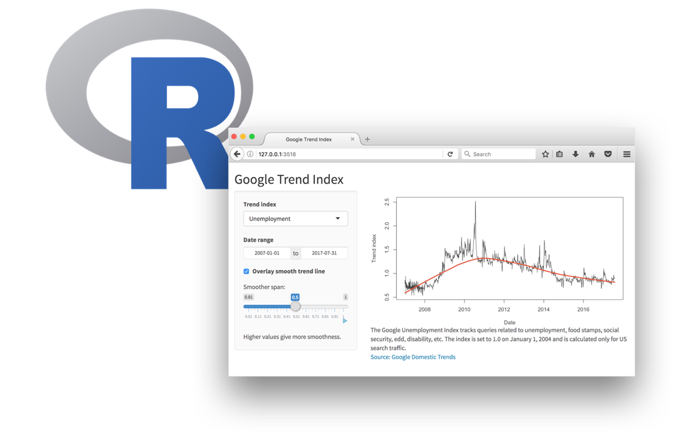
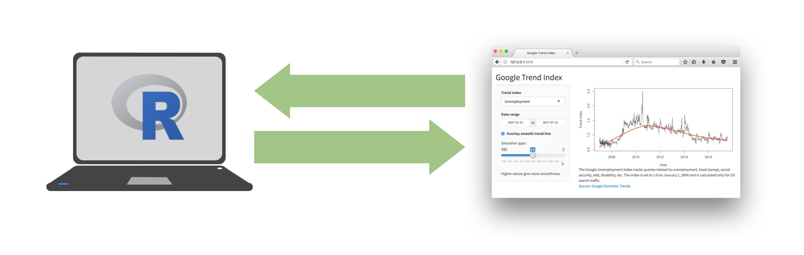
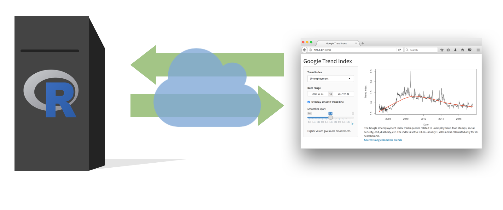
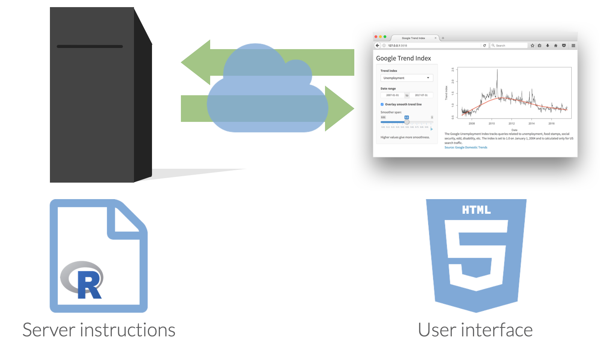

```{r}
#| label = "setup",
#| include = FALSE
# generate CSS file
library(xaringanthemer)
style_duo_accent(
  primary_color = "#B31B1B",
  secondary_color = "#F8981D",
  inverse_header_color = "#222222",
  black_color = "#222222",
  header_font_google = xaringanthemer::google_font("Atkinson Hyperlegible"),
  text_font_google = xaringanthemer::google_font("Atkinson Hyperlegible"),
  code_font_google = xaringanthemer::google_font("Source Code Pro"),
  base_font_size = "24px",
  code_font_size = "20px",
  # title_slide_background_image = "https://github.com/uc-dataviz/course-notes/raw/main/images/hexsticker.svg",
  # title_slide_background_size = "contain",
  # title_slide_background_position = "top",
  header_h1_font_size = "2rem",
  header_h2_font_size = "1.75rem",
  header_h3_font_size = "1.5rem",
  extra_css = list(
    "h1" = list(
      "margin-block-start" = "0.4rem",
      "margin-block-end" = "0.4rem"
    ),
    "h2" = list(
      "margin-block-start" = "0.4rem",
      "margin-block-end" = "0.4rem"
    ),
    "h3" = list(
      "margin-block-start" = "0.4rem",
      "margin-block-end" = "0.4rem"
    ),
    ".tiny" = list("font-size" = "70%"),
    ".small" = list("font-size" = "90%"),
    ".midi" = list("font-size" = "150%"),
    ".tiny .remark-code" = list("font-size" = "70%"),
    ".small .remark-code" = list("font-size" = "90%"),
    ".midi .remark-code" = list("font-size" = "150%"),
    ".large" = list("font-size" = "200%"),
    ".xlarge" = list("font-size" = "600%"),
    ".huge" = list(
      "font-size" = "400%",
      "font-family" = "'Montserrat', sans-serif",
      "font-weight" = "bold"
    ),
    ".hand" = list(
      "font-family" = "'Gochi Hand', cursive",
      "font-size" = "125%"
    ),
    ".task" = list(
      "padding-right" = "10px",
      "padding-left" = "10px",
      "padding-top" = "3px",
      "padding-bottom" = "3px",
      "margin-bottom" = "6px",
      "margin-top" = "6px",
      "border-left" = "solid 5px #F1DE67",
      "background-color" = "#F3D03E"
    ),
    ".pull-left" = list(
      "width" = "49%",
      "float" = "left"
    ),
    ".pull-right" = list(
      "width" = "49%",
      "float" = "right"
    ),
    ".pull-left-wide" = list(
      "width" = "70%",
      "float" = "left"
    ),
    ".pull-right-narrow" = list(
      "width" = "27%",
      "float" = "right"
    ),
    ".pull-left-narrow" = list(
      "width" = "27%",
      "float" = "left"
    ),
    ".pull-right-wide" = list(
      "width" = "70%",
      "float" = "right"
    ),
    ".blue" = list(color = "#2A9BB7"),
    ".purple" = list(color = "#a493ba"),
    ".yellow" = list(color = "#f1de67"),
    ".gray" = list(color = "#222222")
  )
)

source(here::here("R", "slide-opts.R"))
xaringanExtra::use_panelset()
```

```{r}
#| label = "pkgs",
#| include = FALSE,
#| cache = FALSE

# load basic packages
library(knitr)
library(here)
library(countdown)
library(patchwork)
library(flipbookr)
library(scales)

set.seed(1234)
```

class: middle, inverse

# Setup

---

## Setup

```{r message = FALSE, warning = FALSE}
# load packages
library(tidyverse)
library(shiny)

# set default theme for ggplot2
ggplot2::theme_set(ggplot2::theme_minimal(base_size = 16))

# set default figure parameters for knitr
knitr::opts_chunk$set(
  fig.width = 8, fig.asp = 0.618, fig.retina = 2, dpi = 150, out.width = "60%"
)

# dplyr print min and max
options(dplyr.print_max = 10, dplyr.print_min = 10)
```

---

class: middle, inverse

# Shiny: High level view

---

class: middle, center

.center[
Every Shiny app has a webpage that the user visits, <br> and behind this webpage there is a computer that serves this webpage by running R.
]

```{r echo = FALSE, out.width = "80%"}

```

---

class: middle, center

.center[
When running your app locally, the computer serving your app is your computer.
]

```{r echo = FALSE, out.width = "100%"}

```

---

class: middle, center

.center[
When your app is deployed, the computer serving your app is a web server.
]

```{r echo = FALSE, out.width = "100%"}

```

---

class: middle, center

```{r echo = FALSE, out.width = "100%"}

```

---

class: inverse, middle

# Dating rules

---

## Age gaps

```{r aged, include = FALSE}
# source: Dataclysm, pages 42-43
pref_women <- tibble(
  age = 20:50,
  pref = c(23, 23, 24, 25, 25, 26, 27, 28, 29, 29, 30, 31, 31, 32, 32,34, 35, 36, 37, 38, 38, 38, 39, 39, 39, 40, 38, 39, 40, 45, 46)
)
pref_men <- tibble(
  age = 20:50,
  pref = c(20, 20, 21, 21, 21, 21, 22, 21, rep(20, times = 9), 22, 20, 20, 21, 21, 20, 23, 21, 24, 20, 20, 23, 20, 22)
)
```

.pull-left[

```{r women, echo = FALSE, fig.asp = 1, out.width = "100%"}
ggplot(data = pref_women, mapping = aes(x = pref, y = age, label = pref)) +
  geom_abline(slope = -1, linetype = 2, alpha = .5) +
  geom_text(color = "#f542b3", family = "Roboto Condensed", size = 4) +
  scale_x_continuous(breaks = NULL, limits = c(20, 50)) +
  scale_y_reverse(breaks = 20:50) +
  coord_fixed() +
  labs(
    title = "A woman's age <span style = 'color:#f542b3'>vs. the age of the men who look best to her</span>",
    x = NULL,
    y = NULL,
    caption = "Source: *Cataclysm* and OKCupid.com"
  ) +
  theme_classic(base_family = "Roboto Condensed", base_size = 16) +
  theme(
    axis.line = element_blank(),
    axis.ticks = element_blank(),
    plot.title = element_markdown(face = "italic"),
    plot.caption = element_markdown()
  )
```
]

--

.pull-right[

```{r men, echo = FALSE, fig.asp = 1, out.width = "100%"}
ggplot(data = pref_men, mapping = aes(x = pref, y = age, label = pref)) +
  geom_abline(slope = -1, linetype = 2, alpha = .5) +
  geom_text(color = "#f542b3", family = "Roboto Condensed", size = 4) +
  scale_x_continuous(breaks = NULL, limits = c(20, 50)) +
  scale_y_reverse(breaks = 20:50) +
  coord_fixed() +
  labs(
    title = "A man's age <span style = 'color:#f542b3'>vs. the age of the women who look best to him</span>",
    x = NULL,
    y = NULL,
    caption = "Source: *Cataclysm* and OKCupid.com"
  ) +
  theme_classic(base_family = "Roboto Condensed", base_size = 16) +
  theme(
    axis.line = element_blank(),
    axis.ticks = element_blank(),
    plot.title = element_markdown(face = "italic"),
    plot.caption = element_markdown()
  )
```

]

---

## Dating rules

- [A Shiny app for determining if this relationship is skeezy](https://bensoltoff.shinyapps.io/age-rule/)

---

.pull-left[

```r
usethis::use_course("cis-ds/shiny")
```

.task[

- Navigate to the `age-rule` folder, and launch the app by opening the `app.R` file and clicking on *Run App*.
- Close the app by clicking the stop icon
- Select view mode in the drop down menu next to Run App

]
]

.pull-right[
```{r echo = FALSE, fig.align = "center", out.width = "100%"}
knitr::include_app("https://bensoltoff.shinyapps.io/age-rule/", height = "650px")
```
]

---

class: middle, inverse

# Anatomy of a Shiny app

---

## What's in an app?

.pull-left[
```{r eval = FALSE}
library(shiny)

ui <- fluidPage()

server <- function(input, output, session) {}

shinyApp(ui = ui, server = server)
```
]
.pull-right[
- **User interface** controls the layout and appearance of app

- **Server function** contains instructions needed to build app
]

---

## Add elements to app inside `fluidPage()`

```r
library(shiny)

ui <- fluidPage("Hello Everyone!")

server <- function(input, output) {}

shinyApp(ui = ui, server = server)
```

---

## Add elements to app inside `fluidPage()`

```r
fluidPage(
  h1("My Shiny app"),
  "Hello Everyone!"
)
```

---

## Add HTML to `fluidPage()`

* The UI simply creates HTML
* [Can use any HTML tags](http://shiny.rstudio.com/articles/tag-glossary.html)
    * `h1()` = header1
    * `br()` = line break
    * `strong()` = bold text
* Any HTML tag can be accessed using `tags` object
    * `h1` = `tags$h1()`, `br` = `tags$br()`
* Common tags can be accessed without `tags`

---

## Add HTML to `fluidPage()`

```r
fluidPage(
  h1("My Shiny app"),
  h3("Subtitle"),
  "Hello",
  "Everyone!",
  br(),
  strong("bold text")
)
```

---

## Use a layout

* By default, all elements stack up one after the other
* [Can use different layouts](http://shiny.rstudio.com/articles/layout-guide.html)
* We’ll use `sidebarLayout()`

---

## `sidebarLayout()`

.panelset[
.panel[.panel-name[Code]
```r
fluidPage(
  titlePanel("My Shiny app"),
  sidebarLayout(
    sidebarPanel(
      "This is a side panel"
    ),
    mainPanel(
      "And this is the main stuff"
    )
  )
)
```
]

.panel[.panel-name[Output]
```{r echo = FALSE}
include_graphics(path = "images/shiny-sidebarlayout.png")
```
]
]

---

## Inputs and outputs

* For interactivity, app needs inputs and outputs
* **Inputs** - things user can toggle/adjust
* **Output** - R objects user can see, often depend on inputs

---

## Inputs

```r
library(shiny)

ui <- fluidPage(
  sliderInput(
    inputId = "num",
    label = "Choose a number",
    min = 0, max = 100,
    value = 20)
)

server <- function(input, output) {}

shinyApp(ui = ui, server = server)
```

---

## Inputs

```r
sliderInput(inputId = "num", label = "Choose a number",
            min = 0, max = 100, value = 20)
```

```{r echo = FALSE}
print(sliderInput(inputId = "num", label = "Choose a number",
            min = 0, max = 100, value = 20))
```

---

## Inputs

```{r echo = FALSE}
include_graphics(path = "images/shiny-inputs.png")
```

---

## Inputs

.pull-left[

```r
sliderInput(
  inputId = "num", 
  label = "Choose a number",
  min = 0,
  max = 100, 
  value = 20
)
```

]

.pull-right[

* Input name
* Label to display
* Input-specific arguments

]

---

## Outputs

Function | Outputs
---------|---------
`plotOutput()` | plot
`tableOutput()` | table
`uiOutput()` | Shiny UI element
`textOutput()` | text

* Plots, tables, text - anything that R creates and users see
* Initialize as empty placeholder space until object is created

---

# Outputs

```r
library(shiny)

ui <- fluidPage(
  sliderInput(
    inputId = "num",
    label = "Choose a number",
    min = 0, max = 100,
    value = 20),
    plotOutput("myplot")
)

server <- function(input, output) {}

shinyApp(ui = ui, server = server)
```

---

class: inverse, middle

```{r echo = FALSE, out.width = "70%"}
include_graphics(path = "https://media.giphy.com/media/SRkvcNk9BIeAX2gCFX/giphy.gif")
```

---

## Data: Ask a manager

Source: Ask a Manager Survey via [TidyTuesday](https://github.com/rfordatascience/tidytuesday/tree/master/data/2021/2021-05-18)

> This data does not reflect the general population; it reflects Ask a Manager readers who self-selected to respond, which is a very different group (as you can see just from the demographic breakdown below, which is very white and very female).

Some findings [here](https://www.askamanager.org/2021/05/some-findings-from-24000-peoples-salaries.html).

---

## Data: Ask a manager

```{r message = FALSE}
manager <- read_csv("data/survey.csv")
manager
```

---

class: middle

.large[.hand[livecoding]]

.task[
Go to the `shiny` project and code along in `manager-survey/app.R`.
]
